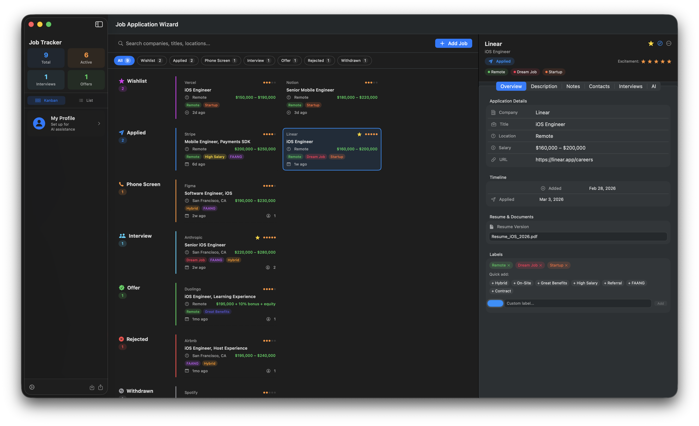

# Job Application Wizard

A native macOS app for managing your job search — track applications on a Kanban board, save job descriptions before they disappear, manage contacts and interview rounds, and get AI-powered help from Claude.

  



---

## Features

### Kanban Board & List View
Pipeline across all stages: Wishlist → Applied → Phone Screen → Interview → Offer → Rejected / Withdrawn. Toggle between a Kanban board and a compact List view at any time. A status filter bar lets you narrow to a single stage — in Kanban mode, filtering shows only that column.

### Job Detail
Each application has a full detail panel with tabbed sections:

- **Overview** — Company, title, location, salary, URL, timeline, resume version used, color-coded labels, excitement rating (1–5), and favorite flag
- **Description** — Full-text job description storage (paste it before the posting disappears). Print, Save PDF, or Copy to clipboard with one click.
- **Notes** — Multi-card note system with title, subtitle, tags, and body. Cards shown in a responsive grid.
- **Contacts** — Track recruiters, hiring managers, and referrals with name, title, email, LinkedIn, notes, and connected status
- **Interviews** — Log each interview round with type, date, interviewers, notes, and completion status
- **AI** — Multi-turn Claude chat assistant (see below)

### AI Chat Assistant (Claude)
A full conversational chat interface powered by Claude, scoped to the job you're viewing. The system prompt includes the job title, company, status, and full description — and, when configured, your personal profile (resume, skills, target roles, work preference) — so Claude has complete context without you having to paste anything.

**Quick-start modes** (pre-populated prompts):
| Mode | What it does |
|---|---|
| Chat | Open-ended conversation about the application |
| Tailor Resume | Get keyword-matched bullet suggestions against the JD |
| Cover Letter | Generate a tailored 3–4 paragraph cover letter |
| Interview Prep | Generate behavioral + technical questions with STAR-framework answers |
| Analyze Fit | Get a fit score and gap analysis against the job description |

After sending a specialized mode prompt, the interface resets to Chat so follow-up questions are natural. The full conversation history is sent with every request for genuine multi-turn context. Token usage and estimated cost are shown after each response.

### My Profile
A personal profile (accessible from the sidebar) feeds context into every AI request:

- Name, current title, location, LinkedIn, website
- Summary, target roles, skills, preferred salary, work preference
- Full resume text and cover letter template

When profile fields are populated, Claude sees structured candidate context alongside the job description, making tailored resume and cover letter output significantly more accurate.

### Settings (⌘,)
A four-tab settings panel:

- **General** — Set your default launch view (Kanban or List), persisted across launches
- **Claude AI** — Enter and save your API key (stored in the system Keychain, never on disk)
- **Data** — Export all applications to CSV, import from CSV (merges by ID), or reset all data with a confirmation dialog
- **About** — App version

### Other
- **Labels** — Tag applications with preset or custom color-coded labels (Remote, Hybrid, Dream Job, Referral, FAANG, etc.)
- **Favorites & Excitement** — Star favorites and rate excitement 1–5 for quick prioritization
- **CSV Import/Export** — Round-trip your data at any time; you always own it
- **PDF Export** — Generate a clean, properly laid-out PDF of any job description
- **Persistence** — Applications and settings saved to JSON in `~/Library/Application Support`. API key stored in the system Keychain.

---

## Requirements

- macOS 14 (Sonoma) or later
- A [Claude API key](https://console.anthropic.com/) for AI features (optional — all other features work without it)

---

## Installation

### Build from source
Requires Xcode command-line tools.

```bash
git clone https://github.com/zacspa/JobApplicationWizard
cd JobApplicationWizard
swift build -c release

# Assemble .app bundle
APP="JobApplicationWizard.app"
mkdir -p "$APP/Contents/MacOS" "$APP/Contents/Resources"
cp .build/release/JobApplicationWizard "$APP/Contents/MacOS/JobApplicationWizard"
cp Info.plist "$APP/Contents/Info.plist"
open "$APP"
```

---

## Setup

1. Launch the app — an onboarding screen walks you through the main features
2. Open **Settings** (⌘,) → **Claude AI** and paste your Anthropic API key
3. Click **My Profile** in the sidebar to add your resume and background (optional, but improves AI output significantly)
4. Press **⌘N** or click **Add Job** to add your first application

The API key is stored securely in the macOS Keychain and never leaves your machine except for direct calls to the Anthropic API.

---

## Architecture

Built with [The Composable Architecture (TCA)](https://github.com/pointfreeco/swift-composable-architecture) by Point-Free.

```
Sources/JobApplicationWizard/
├── App.swift                             # SwiftUI App entry, Window scenes
├── Models.swift                          # JobApplication, JobStatus, JobLabel,
│                                         #   Contact, InterviewRound, Note,
│                                         #   UserProfile, AppSettings, AIAction,
│                                         #   ChatMessage
├── Features/
│   ├── App/AppFeature.swift              # Root reducer — job list, search,
│   │                                     #   filter, settings, profile
│   ├── AddJob/AddJobFeature.swift        # Add job form reducer
│   └── JobDetail/JobDetailFeature.swift  # Detail reducer — all tabs, AI chat,
│                                         #   PDF actions
├── Dependencies/
│   ├── ClaudeClient.swift                # Anthropic API — streaming multi-turn chat
│   ├── PersistenceClient.swift           # JSON load/save, CSV import/export,
│   │                                     #   NSSavePanel / NSOpenPanel
│   ├── PDFClient.swift                   # NSPrintOperation, PDF generation
│   └── KeychainClient.swift             # Secure API key storage
└── Views/
    ├── ContentView.swift                 # Root layout (NavigationSplitView),
    │                                     #   StatusFilterBar, onboarding sheet
    ├── SidebarView.swift                 # Stats, view mode toggle, profile card
    ├── KanbanView.swift                  # Kanban board (respects status filter)
    ├── ListView.swift                    # Compact list view
    ├── JobDetailView.swift               # Detail panel + all tab views + chat UI
    ├── AddJobView.swift                  # Add job form (separate window)
    ├── ProfileView.swift                 # User profile editor sheet
    └── SettingsView.swift                # 4-tab settings panel
```

**Key TCA patterns used:**
- `BindingReducer()` + flat state for all form fields (avoids NavigationSplitView first-responder issues on macOS)
- `@Dependency` for all external clients (Claude, Persistence, PDF, Keychain)
- `.cancellable(id:cancelInFlight:true)` on AI requests to prevent races
- Delegate actions for cross-feature communication (`jobUpdated`, `jobDeleted`)
- `ifLet` scoping for the optional job detail child reducer

---

## License

MIT
